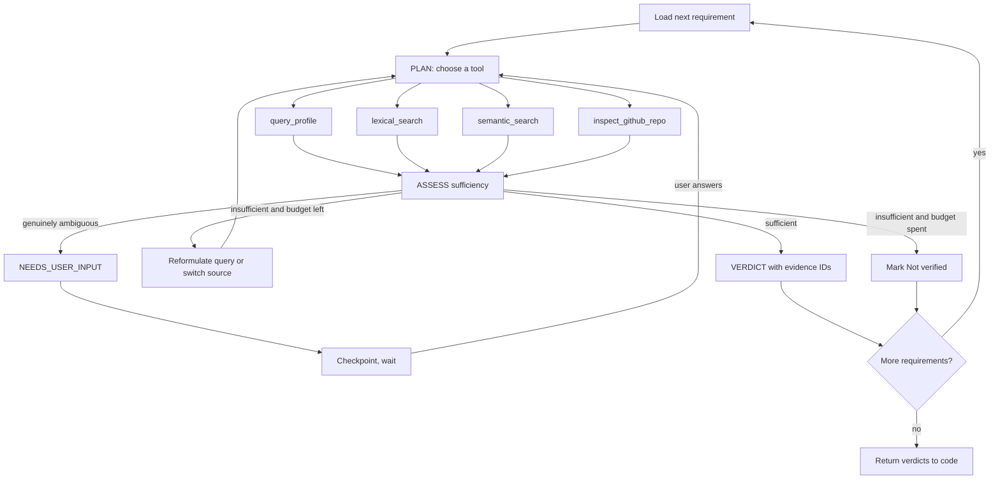

# Agent Architecture

Status: Decided (Phase 0)

## 1. What is and is not an agent here

| Component | Agent? | Reason |
|---|---|---|
| Requirement extraction | No | One constrained structured-output call. No decisions about control flow |
| Eligibility | No | Deterministic rules |
| Evidence Resolution Agent | **Yes** | Chooses tools at runtime, judges sufficiency, reformulates, stops or escalates |
| Scoring and recommendation | No | Arithmetic and policy |
| Tailoring | No | Single generation with evidence input, followed by verification |
| Grounding verifier | No | Bounded verification pass. Final authority is code checking evidence IDs |
| Career preparation | No | A workflow on existing services. Not a separate agent (ADR-0017) |

There is exactly one agent. It handles both profile evidence and external evidence (GitHub). Two agents doing the same loop on different sources would be the fake-agentic pattern.

## 2. Control flow



## 3. Typed state

```
AgentState:
  run_id, owner_user_id, match_id
  requirements: list[Requirement]
  current_index: int
  attempts: list[ToolAttempt]        # tool, query, evidence ids returned
  evidence_seen: set[evidence_id]
  verdicts: list[Verdict]
  pending_question: Question | None
  budget: Budget(remaining_iterations, remaining_tokens, remaining_tool_calls, deadline)
```

## 4. Tools and permission boundaries

| Tool | Reads | Writes | Notes |
|---|---|---|---|
| query_profile | structured profile entries of this user | none | Exact data such as dates, degrees |
| lexical_search | this user's evidence via full-text | none | Names, acronyms, exact skills |
| semantic_search | this user's evidence via vectors | none | Concepts and paraphrases |
| inspect_github_repo | allowlisted GitHub API for repos this user connected | none | Read only, minimal scope, size capped |
| ask_user | none | creates a pending question | Only when the answer cannot come from evidence |

The agent has no tool that writes to the database, calls arbitrary URLs, sends email, executes code, or changes workflow state. All tools take `owner_user_id` from the runtime context, not from model output. Code persists verdicts after validating them.

## 5. Hard limits

Configured, not hardcoded. Per requirement and per run: maximum iterations, maximum tool calls, maximum tokens, wall-clock deadline. When any limit is hit, the requirement becomes **Not verified** with the reason recorded. It never becomes Met.

## 6. Verdict acceptance rules (enforced in code)

1. A verdict of Met or Partial must cite at least one evidence ID that exists, belongs to this user, and was returned by a tool in this run.
2. The quoted evidence span must exist in the cited chunk text.
3. Evidence kind (direct, inferred) is required. Inferred evidence caps the verdict at Partial unless a documented rule says otherwise.
4. A verdict failing these checks is rejected and the requirement retried within budget, then marked Not verified.
5. Absence of evidence yields Not verified, never "candidate lacks skill."

## 7. Human-in-the-loop

```
ANALYZING -> NEEDS_USER_INPUT -> checkpoint -> (wait, possibly days) -> user answers -> resume -> ANALYZING
```

The checkpoint is durable in Postgres. A worker crash at any point resumes from the last checkpoint. The answer the user gives becomes a new evidence chunk with `source_type = user_answer`, so it is itself traceable.

Required test: start analysis, interrupt for user, kill the worker, restart it, provide the answer, resume, complete.

## 8. Untrusted content handling

Job text and repository content are Tier 2. They are passed as clearly delimited data, never as instructions. The extraction call has no tools. The agent's tools are read-only and scoped to one user. Outputs are schema-validated. Evidence is required for conclusions. Assume prompt defenses can fail and design so failure has minimal blast radius. See threat-model.md.

## 9. Observability

Each step writes to `workflow_steps`, each model call to `llm_calls`, each tool call to `tool_calls`. The Run Inspector shows an operational trace (what was done, with counts), not model reasoning text.

## 10. Runtime decision (LangGraph)

Phase 1 checkpoint 1.5 begins with a short spike comparing LangGraph's Postgres checkpointer and interrupt/resume against a hand-rolled loop with our own state table. Criteria: lines of code we would own, resume correctness under worker kill, debuggability, dependency weight. The result is written into ADR-0004. Either way the state schema above is ours and the domain does not import the framework.
