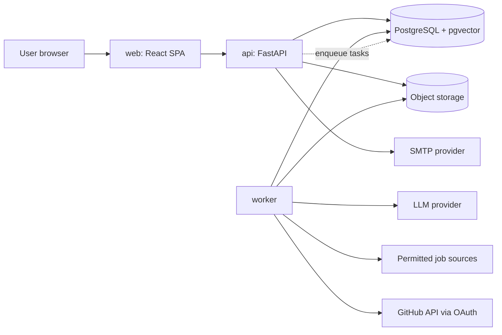
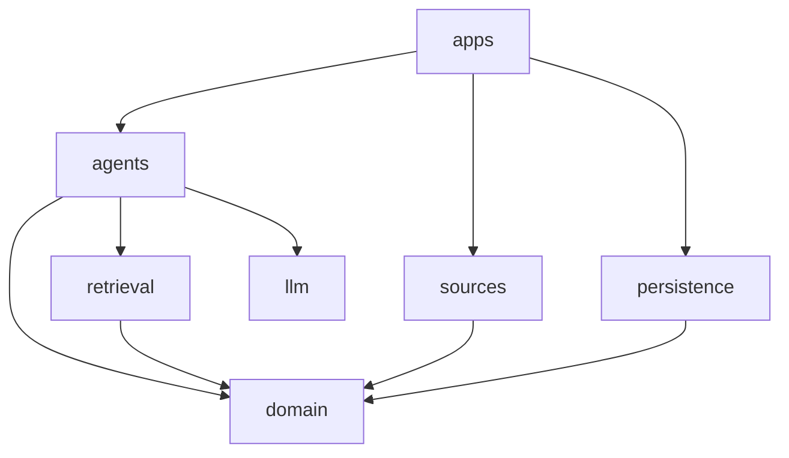
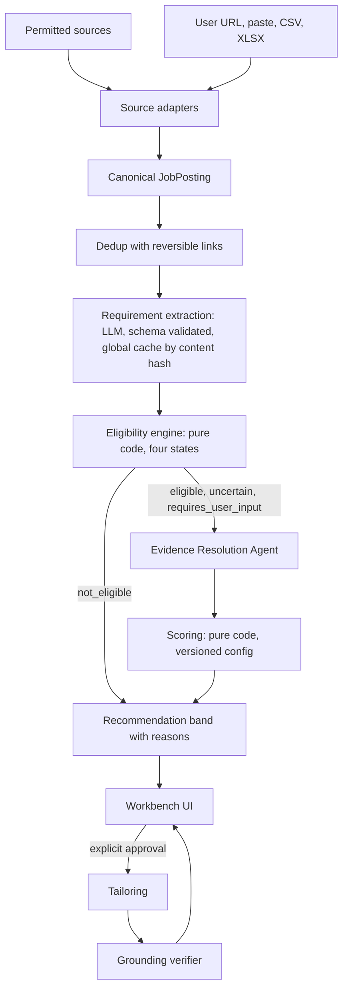
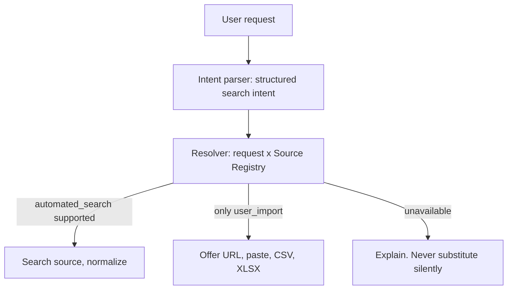
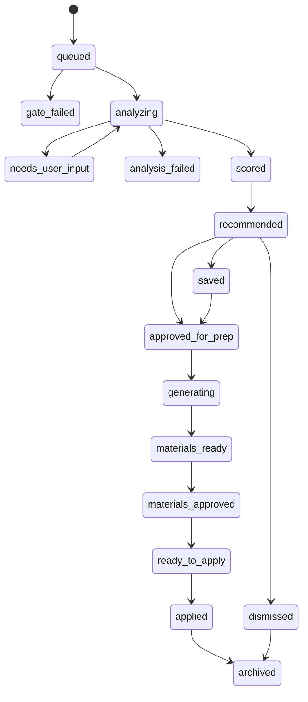

# Architecture Overview

Status: Decided (Phase 0)

## 1. Summary

A modular monolith with three processes (api, worker, web) over one PostgreSQL instance. Postgres also provides the task queue, full-text search, vector search (pgvector) and the agent checkpoint store. There is no Redis and no separate vector database. Every source adapter emits one canonical `JobPosting`, and everything downstream is source-blind.

Rule that shapes everything: **LLMs interpret and reason. Code enforces and computes.**

LLMs are used in four places only: requirement extraction, the evidence resolution agent, tailoring and preparation generation, and the grounding verifier. Filtering, sorting, scoring, dedup, state transitions, authorization and rate limiting are plain code and SQL.

## 2. System context



## 3. Containers

| Container | Responsibility | Never does |
|---|---|---|
| web | UI rendering, client state, accessibility | Business logic, authorization decisions |
| api | HTTP, authentication, authorization, validation, enqueue, reads | Long-running work, LLM calls in request path |
| worker | Task execution: fetch, extract, analyze, generate, export | Serve HTTP |
| postgres | Source of truth, queue, search, vectors, checkpoints | |
| object storage | Resume files and generated exports (private, signed URLs) | Public URLs |
| mailpit (dev only) | Catch outgoing email | |

## 4. Package layout and dependency rule

```
apps/        api, worker, web            (composition and I/O)
packages/
  domain/    pure Python: profile, jobs, eligibility, scoring, recommendation, state
  agents/    evidence resolution graph, tailoring, prompts, schemas
  llm/       provider interface, routing, token accounting
  retrieval/ lexical, semantic, hybrid
  sources/   registry, resolver, adapters, importers
  persistence/ models, repositories, migrations, RLS
  observability/ logging, tracing, cost
  config/    settings with fail-fast validation
```

Allowed import direction:



`domain` imports nothing from the other packages, nor FastAPI, SQLAlchemy, or any agent framework. `import-linter` contracts in CI enforce this mechanically. The web app contains no business logic.

## 4.1 Why one repository, one backend language

Fewer moving parts to learn and operate. A single typed Python codebase shares validation models between API, worker and agents. The frontend is TypeScript. The boundary between them is a generated OpenAPI schema and generated TypeScript types, so the contract cannot drift silently.

## 5. Main pipeline



Discovery answers "how did we find this job." Analysis answers "is this job good for this candidate." They are separate and the analysis never knows the source.

## 6. Source access architecture



- The registry is data: capabilities, rate limits, compliance status, verification date, owner.
- Each posting stores `source` and `acquisition_method` separately. Example: source LinkedIn, method user_import.
- UI copy is generated from those fields so it cannot overclaim.
- Company search prefers the employer's first-party ATS over aggregators.

## 7. Visibility scope

Postings are `public` (from a permitted automated source) or `private` (supplied by one user). Users reach postings through a per-user `job_sightings` row that holds their original values and acquisition method. A private posting is never merged into a public one in a way that exposes user-supplied fields. Only requirement extraction, keyed by content hash of public text, is shared globally. See ADR-0013.

## 8. State machines

Two machines, both transitions made only by code, both logged with actor, time, from, to, run_id, reason.

Posting lifecycle (global): `discovered -> normalized -> active -> stale -> closed`.

Match lifecycle (per user):



There is deliberately no "submitting" or "submitted" state. The product cannot submit applications. `applied` is a user's own record that they applied elsewhere.

## 9. Durable work

Tasks live in a Postgres table. Workers claim rows with `FOR UPDATE SKIP LOCKED`, set a visibility timeout, and retry with exponential backoff and jitter. After max attempts a task becomes a dead letter. Execution is at-least-once, so every handler is idempotent via an idempotency key. Exactly-once delivery is not assumed anywhere.

## 10. Failure classification

Every failure carries a technical error, a recoverability class, and a user-facing message.

| Class | Behavior |
|---|---|
| TRANSIENT | Retry with backoff and jitter |
| PERMANENT | Stop. Record. No retry |
| USER_ACTION_REQUIRED | Pause. Ask the user |
| SOURCE_UNAVAILABLE | Circuit breaker. Continue other sources. Record source health |
| QUOTA_EXCEEDED | Do not run. Preserve state. Show reset time |
| VALIDATION_FAILED | Retry with feedback, optionally escalate model, else mark failed |
| SECURITY_REJECTED | Do not execute. Record security event. Generic user message |
| INTERNAL_ERROR | Record with run_id. Never bare 500 without a stored cause |

## 11. Progressive results

Search shows persisted counters, not invented progress: "Found 187 postings", "187 to 143 unique", "143 to 38 candidates". A progress bar is drawn only when the denominator is stored state. Results appear as each analysis completes.

## 12. Technology choices

| Concern | Choice | Main alternative | Why |
|---|---|---|---|
| API | FastAPI | Django | Typed, OpenAPI generated, light |
| DB | PostgreSQL | MySQL | RLS, JSONB, FTS, pgvector in one engine |
| ORM and migrations | SQLAlchemy 2, Alembic | Raw SQL | Mature, explicit |
| Queue | Postgres SKIP LOCKED | Redis, RabbitMQ | One fewer system at current scale. See ADR-0002 |
| Vectors | pgvector | Pinecone, Qdrant | Same DB, transactional with data. See ADR-0003 |
| Agent runtime | LangGraph, pending spike | Hand-rolled loop | Checkpoint and interrupt. See ADR-0004 |
| Frontend | React, TypeScript, Vite, TanStack Query and Table | Next.js | No SSR need behind login |
| Styling | CSS variables as design tokens, Tailwind mapped to tokens | CSS-in-JS | Semantic tokens, small runtime |
| Auth | Own implementation, opaque cookie sessions | JWT, managed IdP | Revocable, simple. Provider seam kept. ADR-0016 |
| Packaging | uv | pip, poetry | Fast, one lockfile |
| Local runtime | Docker Compose | Native installs | Same on every OS |

Choices stay provisional until the checkpoint that adopts them. If the LangGraph spike shows no benefit over a hand-rolled loop, ADR-0004 changes.
