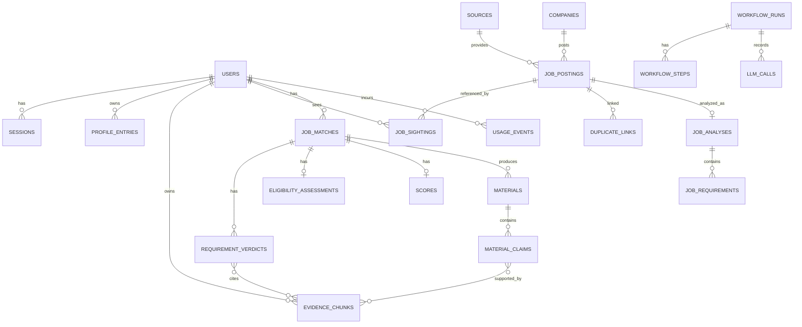

# Data Model

Status: Decided (Phase 0). Columns are indicative. Migrations are the source of truth once written.

## 1. Conventions

- Primary keys are UUIDs.
- Every tenant table has `owner_user_id uuid not null`, an RLS policy, and an index that starts with `owner_user_id`.
- Timestamps are `timestamptz`. Rows have `created_at` and `updated_at`.
- Enumerations are Postgres enums or check constraints. No free-text status columns.
- Content hashes are SHA-256 of normalized text.
- Soft delete only where an audit trail needs it. User deletion is a hard purge workflow.

## 2. Entity relationships



## 3. Table groups

### Identity (tenant root)
| Table | Notes |
|---|---|
| users | email (citext unique), password_hash (Argon2id), role, email_verified_at, plan_id, created_at |
| sessions | token_hash (SHA-256 of random token), user_id, expires_at, revoked_at, user_agent_hash, last_seen_at |
| email_tokens | token_hash, purpose (verify, reset), expires_at, used_at |
| audit_events | actor_user_id, action, target_type, target_id, metadata, created_at. Append only |

### Global (shared, no private user data)
| Table | Notes |
|---|---|
| sources | key, display_name, capabilities[], rate_limit, compliance_status, terms_url, terms_last_verified_at, verification_owner, notes |
| companies | canonical_name, aliases[], domain, career_url, ats_platform, ats_board_id, industry, country, last_verified_at |
| job_postings | visibility (public or private), owner_user_id (null if public), source_id, acquisition_method, external_id, company_id, title, description, canonical_url, location, remote_policy, employment_type, salary_min, salary_max, salary_currency, posted_at, first_seen_at, last_seen_at, content_hash, lifecycle_state |
| duplicate_links | posting_id, duplicate_of_id, method (url, source_external_id, content_hash, normalized_key, fuzzy), confidence, status (proposed, accepted, reversed), decided_by, decided_at |
| job_analyses | content_hash unique, extractor_version, prompt_version, schema_version, model, status, extracted_at |
| job_requirements | analysis_id, kind (required, preferred), category, text, source_span, normalized_skill |

Unique constraints: `(source_id, external_id)` for public postings. `(owner_user_id, content_hash)` for private postings.

### Tenant
| Table | Notes |
|---|---|
| candidate_profiles | one per user, current resume version pointer |
| resumes, resume_versions | file object key, parse status, parser version |
| profile_entries | type (education, work, internship, project, skill, certification, achievement, link), structured JSONB, user_edited flag |
| evidence_chunks | owner_user_id, source_type, source_record_id, text, content_hash, tsvector, embedding vector, embedding_model, created_at |
| preferences | roles, industries, locations, remote, work_authorization (per country), sponsorship_needed, min_comp, employment_types, exclusions |
| job_sightings | owner_user_id, posting_id, original_values JSONB, acquisition_method, import_batch_id, first_seen_at |
| import_batches | per-user import report: imported, skipped, invalid, duplicate counts |
| job_matches | owner_user_id, posting_id, state, run_id |
| eligibility_assessments | match_id, state, gate_results JSONB, rules_version |
| requirement_verdicts | match_id, requirement_id, verdict, evidence_kind, evidence_chunk_ids[], agent_run_id |
| scores | match_id, scoring_version, dimensions JSONB, weights JSONB, band, reasons JSONB |
| materials | match_id, type, status |
| material_claims | material_id, original_text, proposed_text, evidence_chunk_ids[], verifier_status, user_decision |
| feedback | match_id, action, note |
| connector_links | provider, capability, token ciphertext, scopes, last_sync_at |

### Operations
| Table | Notes |
|---|---|
| tasks | type, payload, state, attempts, max_attempts, run_after, locked_until, idempotency_key unique, last_error |
| dead_letters | task copy, final error, failed_at |
| workflow_runs, workflow_steps | run_id, kind, state, started_at, finished_at, error_class |
| state_transitions | entity_type, entity_id, from_state, to_state, actor, run_id, reason, at |
| llm_calls | run_id, purpose, model, prompt_version, input_tokens, output_tokens, cost, latency_ms, content_hash |
| tool_calls | run_id, tool, args_hash, result_summary, duration_ms |
| source_fetch_logs | source_id, status, latency_ms, items, error_class |
| usage_events | user_id, operation, quantity, provider, model, estimated_cost, actual_cost, metadata |
| plans, entitlements | plan to operation limits and period |
| security_events | type, user_id, ip_hash, detail |
| langgraph checkpoints | managed by the checkpointer. Namespaced by run_id and owner |

## 4. Row Level Security pattern

```sql
ALTER TABLE profile_entries ENABLE ROW LEVEL SECURITY;
ALTER TABLE profile_entries FORCE ROW LEVEL SECURITY;
CREATE POLICY tenant_isolation ON profile_entries
  USING (owner_user_id = current_setting('app.user_id', true)::uuid)
  WITH CHECK (owner_user_id = current_setting('app.user_id', true)::uuid);
```

The API sets `app.user_id` with `SET LOCAL` inside each transaction from the authenticated session. The application database role is not the table owner and does not have BYPASSRLS. A separate privileged role runs migrations. Workers set `app.user_id` from the task payload's owner before touching tenant data.

Global tables used by tenants (for example `job_postings`) use policies that allow `visibility = 'public'` or `owner_user_id = current user`.

## 5. Indexing plan

- Tenant tables: `(owner_user_id, ...)` composite indexes first.
- evidence_chunks: GIN on tsvector, HNSW or IVFFlat on embedding. The choice is made from measurement at checkpoint 1.4.
- job_postings: unique indexes listed above, btree on content_hash and canonical_url, trigram index on normalized company and title for fuzzy dedup.
- tasks: partial index on `(run_after) WHERE state = 'queued'`.

## 6. Versioning

Prompts, schemas, extractors, scoring configs and rules carry explicit version strings stored with every result. Any result can be traced to the exact versions that produced it.

## 8. Canonical state vocabularies

One definition per vocabulary. The UI mapping is in [ux-specification.md](../product/ux-specification.md) section 10. The frontend types are generated from the OpenAPI schema (ADR-0019), so there is no second definition.

| Vocabulary | Values |
|---|---|
| Task state (`tasks.state`) | queued, running, succeeded, retry_scheduled, dead_letter, cancelled |
| Match state (`job_matches.state`) | queued, gate_failed, analyzing, needs_user_input, analysis_failed, scored, recommended, saved, dismissed, approved_for_prep, generating, materials_ready, materials_approved, ready_to_apply, applied, archived |
| Resume parse state (`resume_versions.parse_status`) | uploaded, parsing, parsed, parse_failed |
| Resume review state (`resume_versions.review_status`) | pending_review, confirmed |
| Flagged fields (`resume_versions.flagged_field_count`) | Count of parsed fields below the validation threshold. Greater than zero means the UI shows Needs correction |
| Verdict | met, partial, not_verified, conflicting, blocker |
| Evidence kind | direct, inferred, missing, conflicting |
| Claim origin | posting, evidence, inference, suggestion |

Client-only transport states (idle, uploading) exist in the browser and are never stored.
