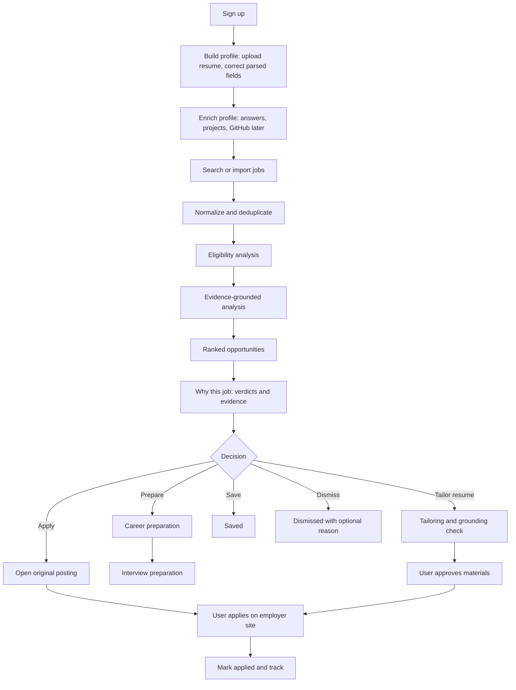

# Product UX Flow

Status: Decided (Phase 0)

## 1. End-to-end flow

The system never submits an application. Step R happens outside Provenance.

## 2. Screen inventory

| Area | Screens | Purpose |
|---|---|---|
| Onboarding | Account, resume upload, profile review, preferences, confirmation | Under about six minutes to first analysis |
| Opportunities | Work queue table, detail pane, filters, saved views | Center of the product |
| Job detail | Overview, eligibility, requirements, evidence, score breakdown, risks and gaps, suggested action, original posting | Trust center |
| Saved | Saved jobs | Shortlist |
| Applications | Tracked applications and status | Record of what the user did |
| Preparation | Overview, question groups, gaps, plan, mock interview, ask anything | Per-job preparation |
| Profile | Entries, evidence, connectors, preferences | Evidence base |
| Runs | Run list and inspector | Transparency |
| Settings | Account, data export, deletion, plan and usage | Control |
| Admin (role gated) | Health, sources, queues, usage | Operations |

## 3. Onboarding contract

1. Account (email, password).
2. Resume upload. Parsed fields appear as editable structured entries, never a block of prose.
3. Preferences.
4. Confirmation screen states: sources that will be searched, sources that need user import, what will be analyzed, what the system will not do, and that applications are never submitted automatically.

Email verification is supported by the architecture and enabled by configuration (see identity-and-data-lifecycle-requirements.md). In local development it does not block onboarding.

## 4. Decision actions on a job

| Action | Effect | Reversible |
|---|---|---|
| Open original | Opens source posting in new tab | n/a |
| Save | Match state saved | Yes. Unsave returns the match to recommended |
| Dismiss | Match state dismissed, optional reason stored as feedback | Yes. Undo returns the match to recommended |
| Prepare | Opens career preparation. Does not spend generation quota until a generation is requested | n/a |
| Tailor resume | Requires explicit approval step. Starts generation workflow | Output can be rejected |
| Mark applied | User record only. Asks for confirmation naming the company and role | Yes. Undo returns the match to ready_to_apply and is logged |

## 5. States and progress

Screen states, operation states and progress rules are defined once, in [ux-specification.md](ux-specification.md) sections 9 and 10 and [ai-ux-patterns.md](ai-ux-patterns.md) section 6. This document does not redefine them.

## 7. Wording rules

- Say what was done: "Analyzed 18 LinkedIn jobs imported by you."
- Predictions use hedged language: "Likely question", "High-priority preparation area".
- Never "Our AI searches every website."
- No em dashes.
